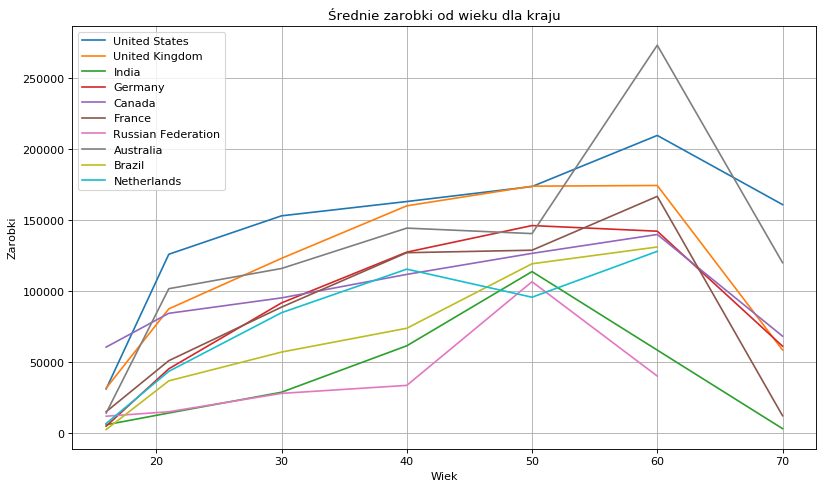

# Stackoverflow Analysis

## About the Project

## Part 1

I was analyzing data from the annual survey conducted by Stackoverflow. You could
download this data here: https://www.kaggle.com/stackoverflow/stack-overflow-2018-developer-survey.
I focused on:
* most popular IDEs,
* most popular frameworks,
* age and education degrees of programmers,
* average salaries per country.

## Author
Miłosz Gajowczyk

