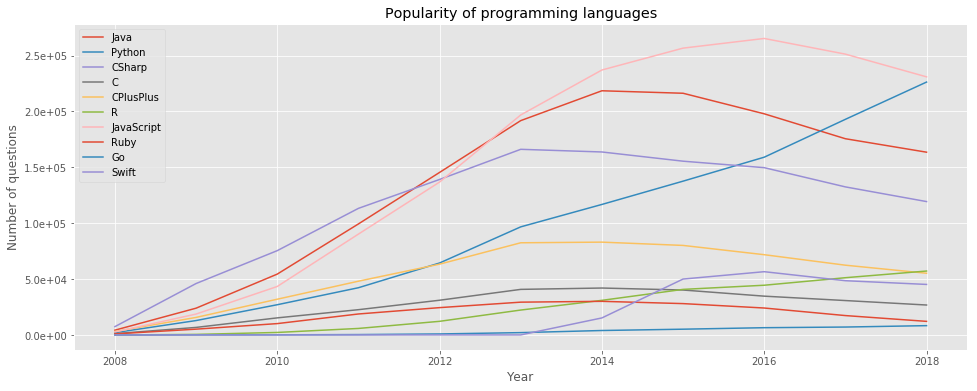

# Stackoverflow BigQuery Analysis

## About the Project

## Part 2

I was analyzing data from the Stackoverflow service using BigQuery and SQL. 
These time I focused on:
* number of questions per year,
* most popular languages by tags,
* answers coefficient, 
* StackOverflow user status.

## Author
Miłosz Gajowczyk

