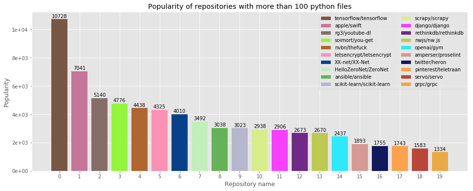

# GitHub Analysis

## About the Project

## Part 3

I was analyzing data from the Stackoverflow service using BigQuery, Pandas, and SQL. 
These time I focused on:
* most popular languages by extension,
* most popular repositories with more than 100 .py files,
* the most popular language based on the most popular repositories.

## Author
Miłosz Gajowczyk

