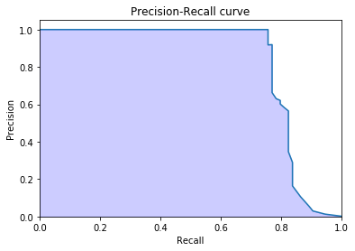

# Fraud detection with imbalanced data

## About the Project

Detection of fraud is a very important part of data analysis,
data which in such situations are very unbalanced.

I have tried to combine several approaches to this problem and create
one coherent model that will detect credit card frauds. 
After a deeper analysis, the combination of random forest, 
gradient boosting and isolation forest worked best.

I only used 25% of the original data. Links to data sets below:

whole dataset:

https://www.kaggle.com/mlg-ulb/creditcardfraud

25% of dataset

https://drive.google.com/drive/folders/1Pef3U6Zg7crdS79u4n101nEs8TqUmabK?fbclid=IwAR1LtVtDopLlQNhkdDMUZEkNmKnYQ0oV54uUGSzPC83SgAvYePJuYLJF8bs

Before using notebook you havve to download data and 
put it into data directory.

  

  

  

  

## Author
Miłosz Gajowczyk

