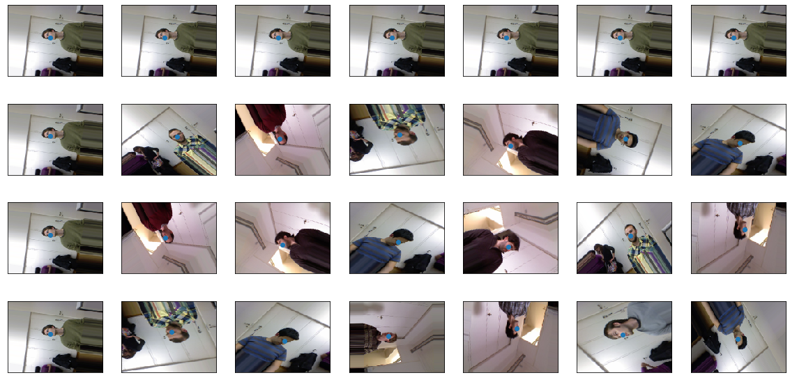
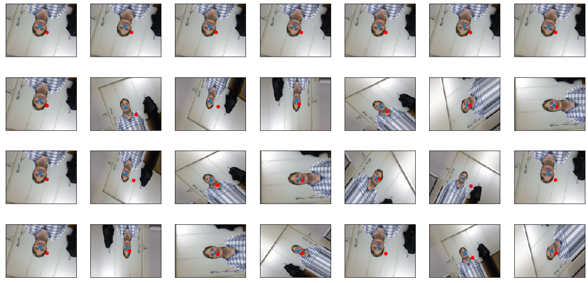

# Face detection with CNN

## About the Project

Simple pipeline to create face detection model that can be useful in adding photo filters.

## About dataset 

The dataset contains over 15K images of 20 people (6 females and 14 males - 4 people were recorded twice).
or each frame, a depth image, the corresponding rgb image (both 640x480 pixels), 
and the annotation is provided. The head pose range covers about +-75 degrees yaw and +-60 degrees pitch. 
Ground truth is provided in the form of the 3D location of the head and its rotation.

You can download dataset from: https://s3.amazonaws.com/fast-ai-imagelocal/biwi_head_pose.tgz

## Dataset source

@article{fanelli_IJCV,
author = {Fanelli, Gabriele and Dantone, Matthias and Gall, Juergen and Fossati, Andrea and Van Gool, Luc},
title = {Random Forests for Real Time 3D Face Analysis},
journal = {Int. J. Comput. Vision},
year = {2013},
month = {February},
volume = {101},
number = {3},
pages = {437--458}
}

## Project - current results 

Model performance.

| loss  | mae | 
| ---- | ---- |
| 4.377246 | 2.036525 | 

Example images after augmentation.

  

Example predictions marked with red dots.

  

## Author
Miłosz Gajowczyk
