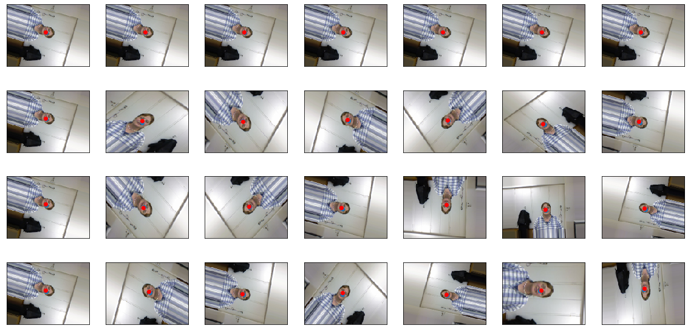

# ML workshops

## Project descrption

ML workshops has purpose to increase the knowledge about Machine Learning, data processing and data visualization among **KN Solvro** members.

## Project structure 

This project has specific structure. Each feature branch from `master` is maintained by one person. After finishing milestone (i.e. subproject of `ML workshops`) best feature branch is going to merged to create **best possible KN Solvro ML portfolio**.

## Project - current results 

Model performance.

| loss  | mae | mse | 
| ---- | ---- | ---- |
| 166.092 | 11.9992 | 228.288 |

Example images after augmentation.

  

Example predictions marked with red dots.

  

