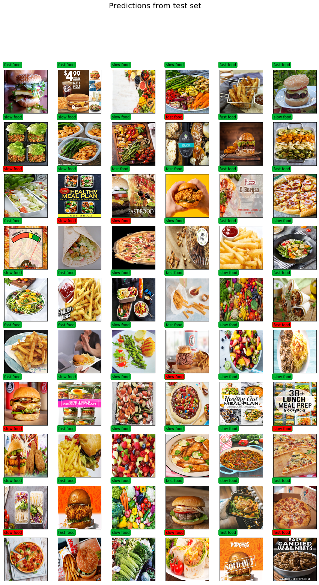
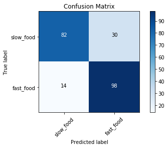
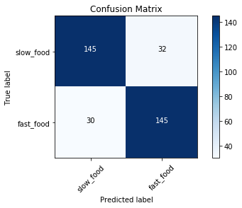

# Food classifier with CNN

## About the Project

Imagine that we create a method used to track a person's nutrition. 
With each meal, it is supposed to take a photo of the dish. 
One of its functions is to make sure that the user 
does not start eating too much junk food and here we need help!

The task sounds simple. However, what to do if the data is not enough?

Deep learning offers ways to deal with these types of problems. 
My attempt to solve this task was based on several of them. 
Namely, pretrained-model and transfer learning. 
With their help, I was able to teach the model with 81% accuracy.

I believe that it is possible to train the model for this task 
with much greater accuracy. However, this is my first deep learning project 
and I still miss a lot to be a specialist.

	
	
	

## Author
Miłosz Gajowczyk

