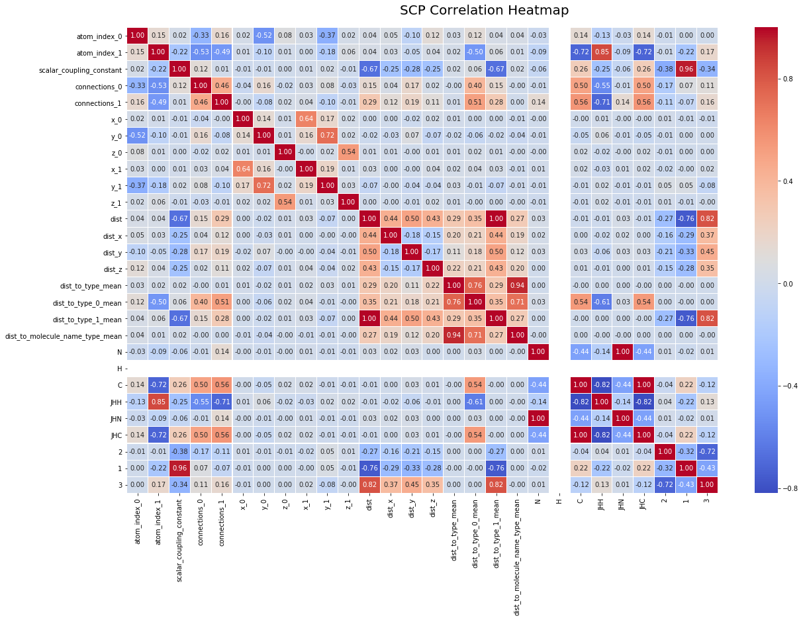
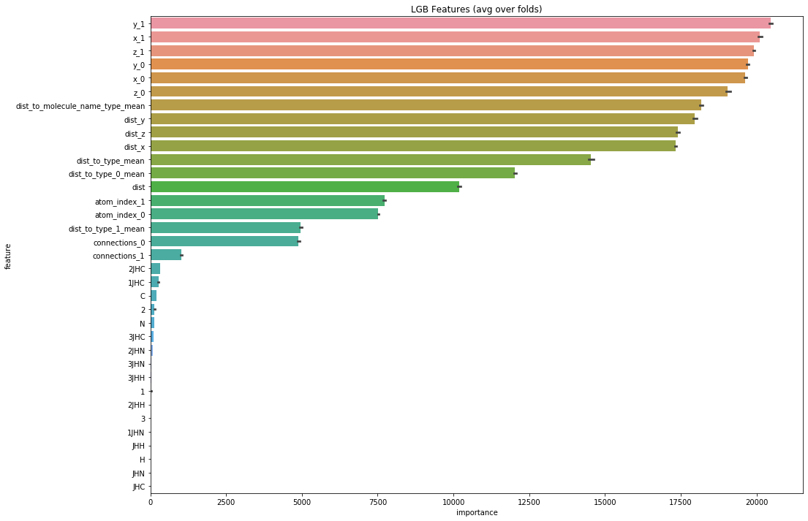
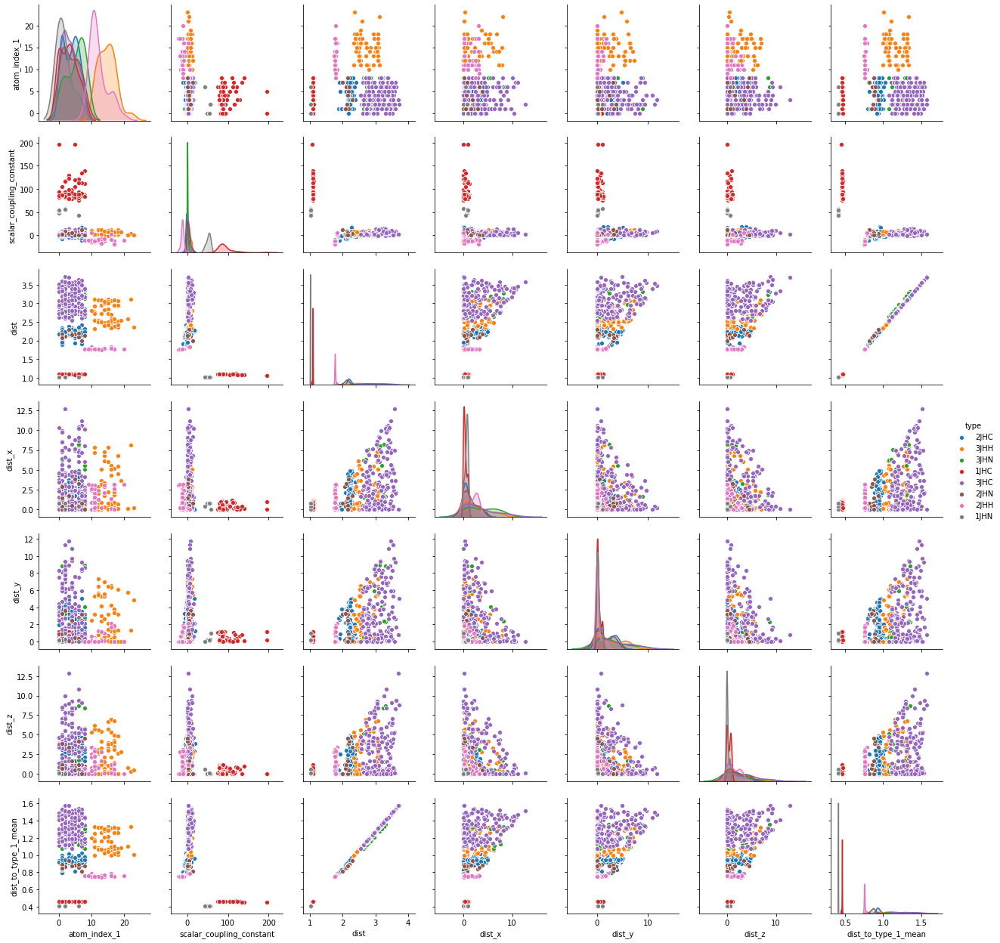

# Scalar coupling projcet

## About the Project
This challenge aims to predict interactions between atoms.
Imaging technologies like MRI enable us to see and 
understand the molecular composition of tissues. 
Nuclear Magnetic Resonance (NMR) is a closely 
related technology which uses the same principles 
to understand the structure and dynamics of proteins and molecules.

Researchers around the world conduct NMR experiments to 
further understanding of the structure and dynamics of molecules,
across areas like environmental science, pharmaceutical science, and materials science.

dataset:

https://www.kaggle.com/c/champs-scalar-coupling

## Caution
Before running project you should add directories: 'models', 'data', 'obj' to project 
directory. I didn't upload them because of lack of storage space. 

* models - directory for trained models.

* data - directory for original data and preprocessed data

* obj - directory for important objects (for example directory with information about model)

  

  

  

## Author
Miłosz Gajowczyk

