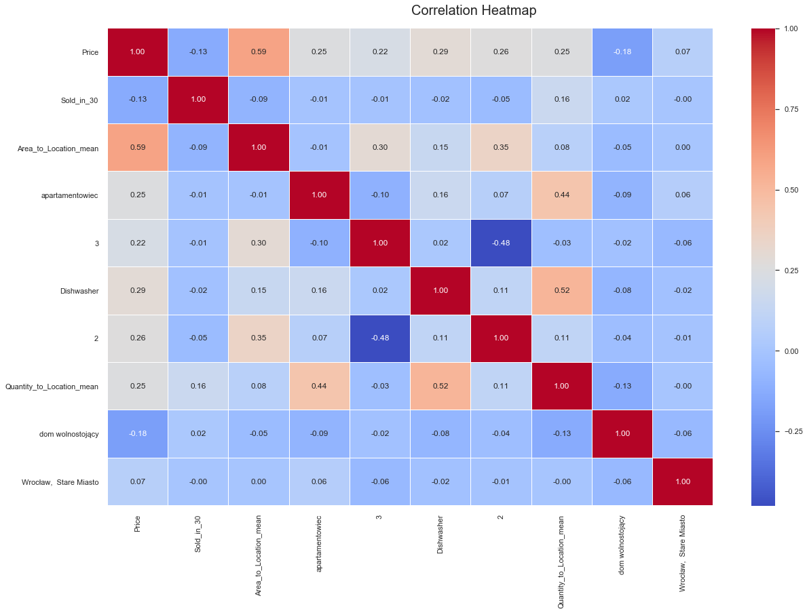
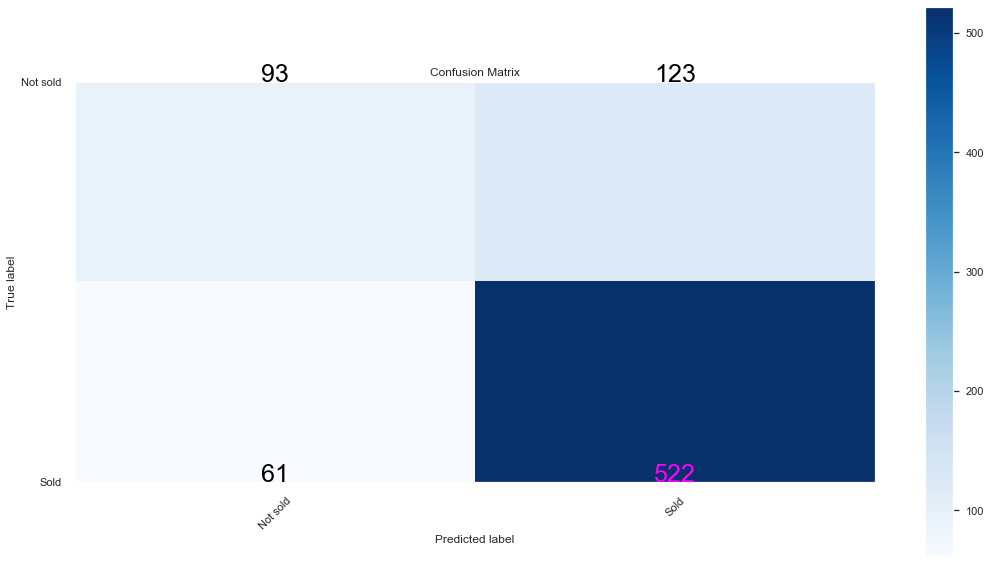
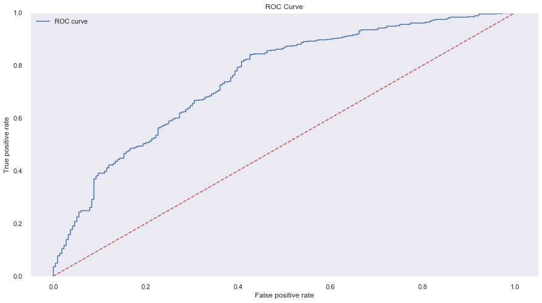

# Predicting Wrocław’s flats prices

## About the Project

Project realised with a group of my friends. The project aimed to analyze housing prices in Wroclaw and create two predictive models:

* regression model - predicting the rent price of the apartment.

* classification model - predicting if the flat will be sold within 30 days.

The main goal of the project was to learn how to organize 
group work and create a simple pipeline in  machine learning and data analysis projects.

The notebook is preapared to use with jupyter notebook or google colab notebook.

The notebook is constructed in such a way 
that it implicitly uses the models I have trained. 
If you want to teach your own models, 
throw the selected models yourself from the 'models' folder.

  

  

  

  

## Authors
Noemi Domagała, Miłosz Gajowczyk, Filip Sowiński

