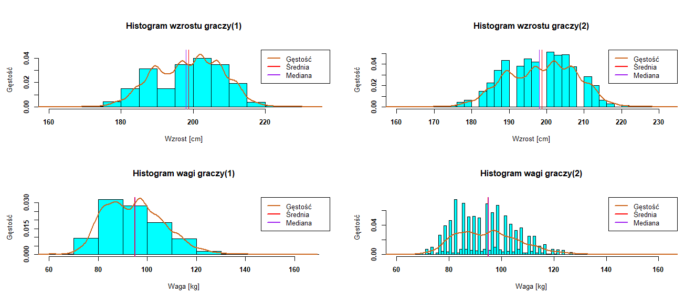

# NBA players analysis

## About the Project

The project purpose was to analyze dependencies between player's height, weigth and possition.
I was checking data from keggle: https://www.kaggle.com/drgilermo/nba-players-stats.
You could read about details of my research in NBA_players_report.pdf file.

Underneath the most important conclusions:
* The coefficient of variation for the weight of NBA athletes 
is almost three times greater than the coefficient of variation for growth. 
* It is worth analyzing histograms with differently chosen intervals because 
it can provide us with additional information.
* You can try to normalize the scatter plot by adding a coefficient 
that consists of both variables. As a result, we can get a more 
readable graph that tells us about the relationship between the variables studied.
* The way in which we select points in the histogram is of great 
importance because ill-chosen ones can completely change the appearance of our chart.
* In the case of growth, we deal with a delicate left-hand asymmetry, 
which means that more observations are noticeable above the average.
* On weight histogram, we have a delicate right-side asymmetry, 
which means that the majority of players have an under-average weight.

## Author
Miłosz Gajowczyk

